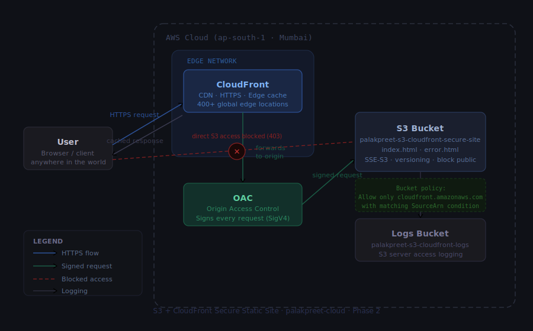

# S3 + CloudFront Secure Static Site

A secure static website hosted on Amazon S3 and served through Amazon CloudFront using Origin Access Control (OAC). Direct access to the S3 bucket is fully blocked — content is only accessible via CloudFront over HTTPS.

Built as part of my cloud engineering portfolio roadmap (Phase 2).

---

## Architecture

| Component | Service | Purpose |
|---|---|---|
| Static file storage | Amazon S3 | Stores index.html and error.html |
| CDN + HTTPS | Amazon CloudFront | Serves content globally, enforces HTTPS |
| Secure origin access | OAC (Origin Access Control) | Signs every CloudFront → S3 request |
| Encryption at rest | SSE-S3 | All objects encrypted with AWS-managed keys |
| Access logging | S3 Server Access Logging | Every request logged to a separate logs bucket |

---

## Security Design

**No public S3 access.** All four Block Public Access settings are enabled. The bucket has no public bucket policy — it only allows requests signed by the specific CloudFront distribution via OAC.

**HTTPS only.** CloudFront is configured to redirect HTTP → HTTPS. No user can reach the site over plain HTTP.

**OAC over OAI.** Origin Access Control (OAC) is used instead of the legacy Origin Access Identity (OAI). OAC supports AWS Signature Version 4 and works with SSE-KMS encrypted buckets — OAI does not.

**Least privilege bucket policy.** The bucket policy allows only `s3:GetObject`, only from `cloudfront.amazonaws.com`, and only when the `AWS:SourceArn` matches this specific distribution. Any other request returns 403.

---

## Resources Created

| Resource | Name | Region |
|---|---|---|
| S3 bucket | `palakpreet-s3-cloudfront-secure-site` | ap-south-1 |
| Logs bucket | `palakpreet-s3-cloudfront-logs` | ap-south-1 |
| CloudFront distribution | `palakpreet-cloudfront-s3-distribution` | Global (edge) |
| OAC | Auto-created by CloudFront wizard | — |

**S3 bucket settings:**
- Versioning: enabled
- Encryption: SSE-S3 (AES-256)
- ACLs: disabled (bucket owner enforced)
- Block all public access: enabled
- Static website hosting: disabled (intentional — served via CloudFront origin, not S3 website endpoint)

---

## Why I Chose These Services

**S3** — Object storage is the natural fit for static files. No server to manage, infinitely scalable, 11 nines durability. Cost is near-zero for a portfolio project.

**CloudFront** — Needed HTTPS without setting up a web server. CloudFront also caches content at 400+ edge locations globally, so the site loads fast for any visitor regardless of location. AWS Shield Standard (free DDoS protection) is included.

**OAC** — The modern replacement for OAI. Ensures only my CloudFront distribution can read from S3. Without this, blocking public access would break the site; with it, S3 is locked down and CloudFront is the only valid entry point.

**SSE-S3** — Free, automatic encryption at rest. No key management overhead. Sufficient for a static site with no sensitive data. (SSE-KMS would be appropriate if the content required customer-managed key rotation — noted as a production upgrade.)

**S3 server access logging** — Logs every request to the bucket into a separate logs bucket. Useful for auditing who accessed what and when, debugging 403 errors, and demonstrating security awareness.

---

## What I Would Add in Production

- **AWS WAF** — Web Application Firewall to block SQLi, XSS, and bad bots (~$14/month)
- **Custom domain** — Route 53 + ACM certificate for HTTPS on a custom domain
- **CloudFront access logs** — Separate from S3 access logs; captures edge-level request data
- **SSE-KMS** — Customer-managed keys for stricter encryption control
- **S3 Object Lock** — WORM protection for compliance use cases

---

## Learning Notes

See [CONCEPTS.md](CONCEPTS.md) for detailed explanations of every concept used in this project — OAC vs OAI, why S3 static website hosting is disabled, SSE-S3 vs SSE-KMS, bucket policies, and more.
