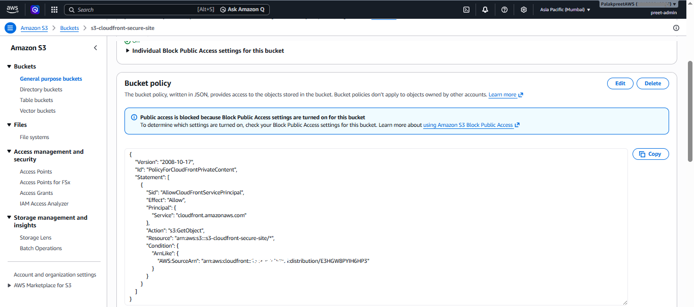
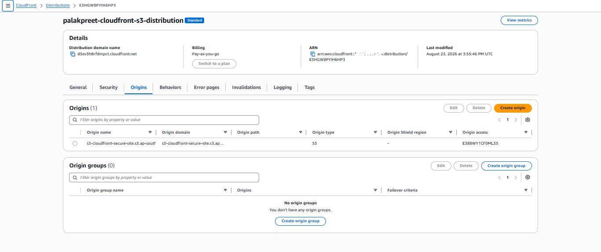
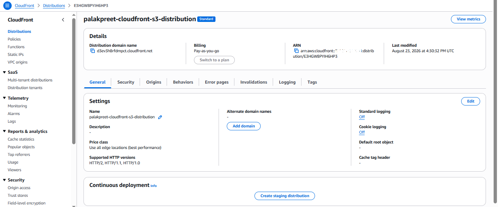
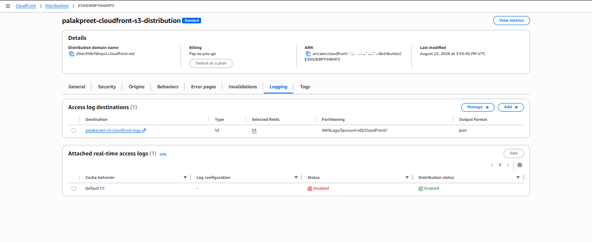
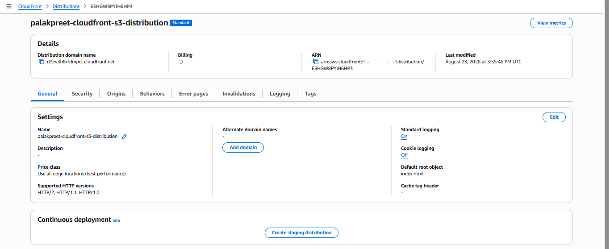
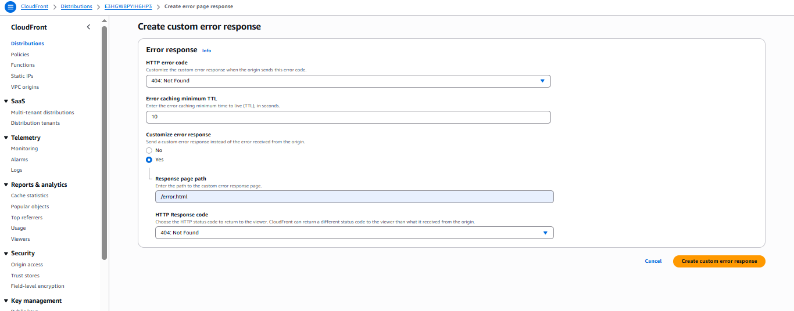
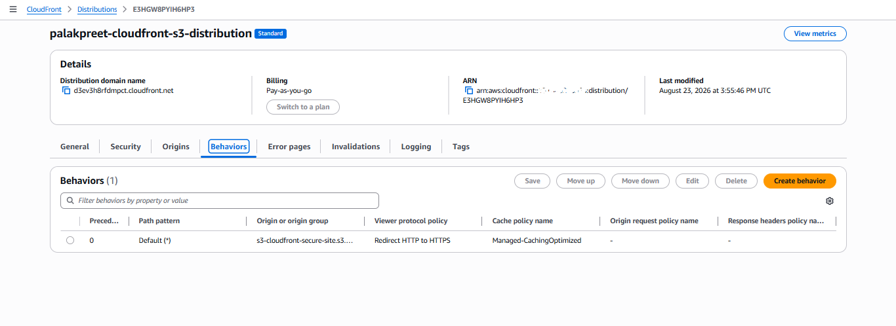
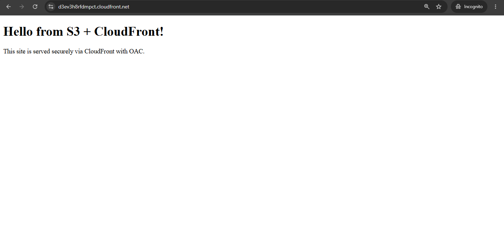
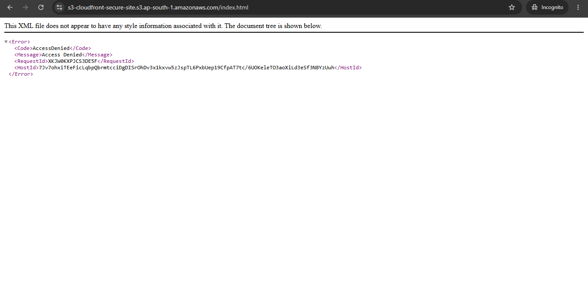

## CloudFront + OAC Configuration (Phase 2)

The following screenshots document the CloudFront distribution setup, its Origin Access Control (OAC) configuration, and the two access tests proving the security model works as intended.

---

### 1. S3 Bucket Policy (OAC)

The bucket policy auto-generated by CloudFront after enabling OAC. Grants `s3:GetObject` only to the CloudFront service principal, scoped to this specific distribution via the `AWS:SourceArn` condition. No other principal, action, or distribution can access this bucket.

---

### 2. CloudFront Origin — OAC Confirmed

The distribution's Origins tab, showing the S3 origin configured with Origin access = OAC (`E388WY1CF0ML35`), using the REST API endpoint (not the static website endpoint). Confirms OAC from the CloudFront side, pairing with the bucket policy above.

---

### 3. CloudFront General Settings — Before Configuration

Initial state right after distribution creation: Status = Enabled, but Default root object and Standard logging both still unset. Captured as a "before" baseline ahead of the configuration steps below.

---

### 4. CloudFront Logging Enabled

Standard (access) logging configured to deliver to the dedicated logs bucket (`palakpreet-s3-cloudfront-logs`), separate from the content bucket.

---

### 5. Default Root Object Set

Default root object set to `index.html`, so requests to the bare CloudFront domain resolve to the site's homepage.

---

### 6. Custom Error Response (403 → error.html)

Custom error response configured: HTTP 403 (Forbidden) now returns `/error.html` instead of raw AWS XML.

---

### 7. HTTPS Redirect (Viewer Protocol Policy)

Default cache behavior's Viewer Protocol Policy set to "Redirect HTTP to HTTPS" — all traffic is forced onto an encrypted connection.

---

### 8. Access Test 1 — CloudFront URL Loads

The site loading correctly over HTTPS at the CloudFront distribution domain (`d3ev3h8rfdmpct.cloudfront.net`), tested in an incognito window to rule out cached/local session artifacts.

---

### 9. Access Test 2 — Direct S3 Access Denied

Direct request to the S3 bucket's REST endpoint returns `AccessDenied`. This proves the bucket is genuinely private and CloudFront + OAC is the only valid path to the content — the security model isn't just configured, it's verified.

---

**Summary:** all 9 screenshots together demonstrate the full chain — OAC configured on both sides (S3 + CloudFront), supporting settings in place (root object, logging, error handling, HTTPS enforcement), and both the allowed and denied paths tested and confirmed.
